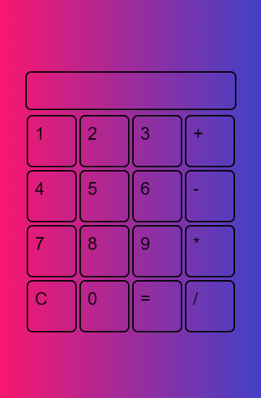

## Project Screenshots

### Mobile View

### Desktop View

### Notes:

It's a simple & responsive Calculator created using Event Bubbling concept.Java Script, HTML, CSS is used to create it. This project will show how to implement Event Bubbling for nested elements using event-listener.

### Output

Check here: [https://titli9830.github.io/Event-Bubbling-Concept/](https://titli9830.github.io/Event-Bubbling-Concept/) 

OR

Download & save the code in your machine. Open the html file in any browser to see the result

### Source Code Link

Check Here: [https://github.com/titli9830/Event-Bubbling-Concept](https://github.com/titli9830/Event-Bubbling-Concept)
